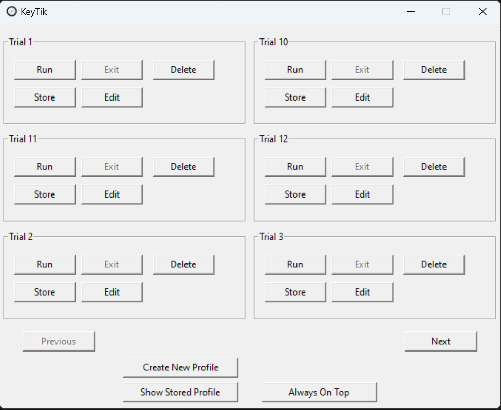
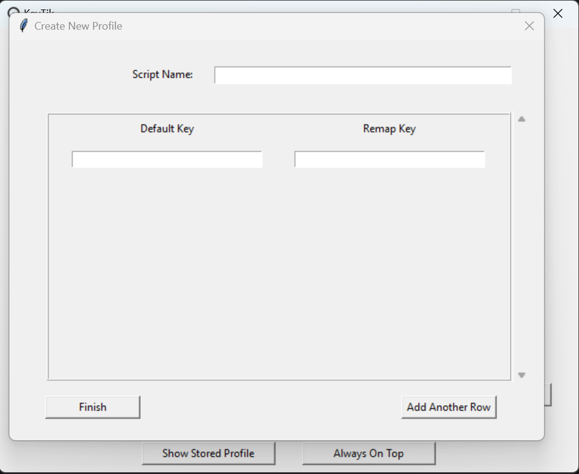

# KeyTik : Keyboard Remapper With Profile
  KeyTik is a lightweight keyboard remapper that support profile. It use AutoHotkey as remapper.
It only have one file as executeable using pyinstaller to make it, so it might a bit long to 
star (Maybe i will change it in the future). Anyway i make it for personal use at first, but then 
why not to share it. So enjoy!!

------------------------------------------------------------------------------------------------------------------------------------------------------------------------------

* Preview :

* How To Install :
1. Download the zip file then extract it.
2. Download AutoHotkey from : https://www.autohotkey.com/ .
3. Double click on the KeyTik.exe to run.
4. Done

* Features :
1. Create Remap Profile.
2. Run & Exit Remap Profile.
3. Delete & Store Remap Profile.
4. Edit Remap Profile.
5. Make Window Always On Top.

* Feature Plan (Possibly to be Implemented) :
1. Show Stored Profile.
2. Run Profile On Startup.
3. Helper to Know What Remap Key in Profile.

* Others :
SourceForge : https://sourceforge.net/projects/keytik .

AutoHotkey Web :
https://www.autohotkey.com/

## License

This project is licensed under the [Apache License 2.0](http://www.apache.org/licenses/LICENSE-2.0). You can freely use, modify, and distribute this code under the terms of the license.

