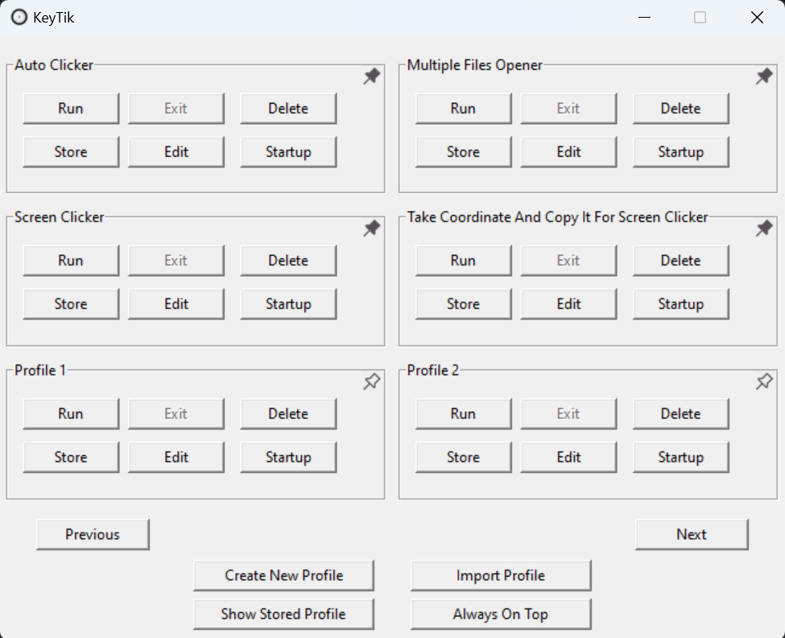
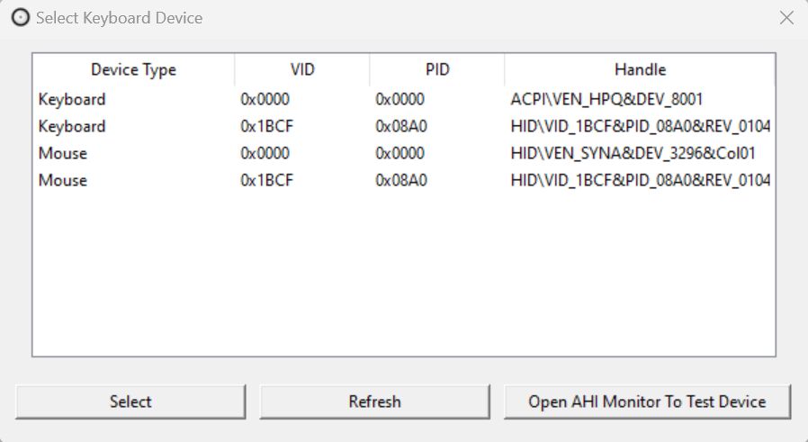

<div align="center">
  
  <br><br>
  
[](https://tooomm.github.io/github-release-stats/?username=Fajar-RahmadJaya&repository=KeyTik)
[](https://sourceforge.net/projects/keytik/files/stats/timeline)


# KeyTik: The All-in-One Automation Tool

### GUI-Based Keyboard Remapper with Profiles, Auto Clicker, Screen Clicker, Multiple Files Opener, AutoHotkey Script Manager and More.

</div>

<br>

-----------------------------------------------------------------------------------------------------------------------------------------------------------------------------
<br>

## Overview

KeyTik is an open-source, all-in-one automation tool that lets you automate nearly anything at your will. Initially, KeyTik focused on being a keyboard remapper with profiles, allowing you to activate or deactivate each remap individually. However, since KeyTik uses AutoHotkey as the scripting language, it can handle all types of automation available in AutoHotkey, such as auto-clicking, keyboard remapping, screen clicking, opening multiple files, and more. Additionally, the use of AutoHotkey has made KeyTik an AutoHotkey script manager. This means you can easily run, exit, run on startup, edit, store, delete, and more on your AutoHotkey scripts.

With a bit of scripting, you can do almost all automation tasks with ease. If you don't have coding experience, don't worry! I’ve created a beginner-friendly open-source [AutoHotkey script collection and template](https://github.com/Fajar-RahmadJaya/AutoHotkeyCollection) that allows you to download pre-made scripts or edit them to your preference. I’ve tried to make it as easy to understand as possible, with guides on how to use the templates or customize the scripts.

So, if you're looking for a lightweight auto-clicker, keyboard remapper, screen clicker, multiple files opener, and AutoHotkey script manager with a user-friendly GUI in a single software, then this is exactly what you need! I hope you enjoy using KeyTik and find it useful.

Sincerely,  
**Fajar Rahmad Jaya**

> [!NOTE]
> **If you're satisfied with KeyTik, don't forget to give us a star!**  
> **Also, share it and help the world learn more about us.**

## Platform
KeyTik is available at the following platforms:
- [SourceForge](https://sourceforge.net/projects/keytik/)
- [PtchHub](https://www.pitchhut.com/project/keytik)

## Table Of Content
1. [Preview](https://github.com/Fajar-RahmadJaya/KeyTik?tab=readme-ov-file#preview)
2. [How To Install](https://github.com/Fajar-RahmadJaya/KeyTik?tab=readme-ov-file#how-to-install)
   - [How To Install AutoHotkey and Interception Driver Using Command Line](https://github.com/Fajar-RahmadJaya/KeyTik?tab=readme-ov-file#how-to-install-autohotkey-and-interception-driver-using-command-line)
4. [Features](https://github.com/Fajar-RahmadJaya/KeyTik?tab=readme-ov-file#features)
5. [What Make Us Different Then Other Automation Tool](https://github.com/Fajar-RahmadJaya/KeyTik?tab=readme-ov-file#what-make-us-different-then-other-automation-tool)
6. [How To Use KeyTik Automation Tool](https://github.com/Fajar-RahmadJaya/KeyTik?tab=readme-ov-file#how-to-use-keytik-automation-tool)
   * [Auto Clicker](https://github.com/Fajar-RahmadJaya/KeyTik?tab=readme-ov-file#auto-clicker)
   * [Screen Clicker](https://github.com/Fajar-RahmadJaya/KeyTik?tab=readme-ov-file#screen-clicker)
   * [Screen Coordinate Auto Detect And Copy](https://github.com/Fajar-RahmadJaya/KeyTik?tab=readme-ov-file#screen-coordinate-auto-detect-and-copy)
   * [Multiple Files Opener](https://github.com/Fajar-RahmadJaya/KeyTik?tab=readme-ov-file#multiple-files-opener)
7. [What can You do With KeyTik](https://github.com/Fajar-RahmadJaya/KeyTik?tab=readme-ov-file#what-can-you-do-with-keytik)
8. [How Is KeyTik Work](https://github.com/Fajar-RahmadJaya/KeyTik?tab=readme-ov-file#how-is-keytik-work)
   * [How is Remapper And Automation Tool work](https://github.com/Fajar-RahmadJaya/KeyTik?tab=readme-ov-file#how-is-remapper-and-automation-tool-work)
   * [How is Assign Keyboard or Mouse on Specific Device VID & PID or Device Handle Work](https://github.com/Fajar-RahmadJaya/KeyTik?tab=readme-ov-file#how-is-assign-keyboard-or-mouse-on-specific-device-vid--pid-or-device-handle-work)
9. [Supported Key List](https://github.com/Fajar-RahmadJaya/KeyTik?tab=readme-ov-file#supported-key-list)
10. [Does KeyTik Safe to Use?](https://github.com/Fajar-RahmadJaya/KeyTik?tab=readme-ov-file#does-keytik-safe-to-use)
11. [Have Any Suggestion?](https://github.com/Fajar-RahmadJaya/KeyTik?tab=readme-ov-file#have-any-suggestion)
12. [License](https://github.com/Fajar-RahmadJaya/KeyTik?tab=readme-ov-file#license)
13. [Contributing](https://github.com/Fajar-RahmadJaya/KeyTik?tab=readme-ov-file#contributing)
14. [Star History](https://github.com/Fajar-RahmadJaya/KeyTik?tab=readme-ov-file#star-history)
15. [Acknowledgements](https://github.com/Fajar-RahmadJaya/KeyTik?tab=readme-ov-file#acknowledgements)

## Preview





## How To Install
To install KeyTik you just need to follow these step:
1. **Download And Install AutoHotkey, Interception Driver (Optional If You Use Assign Profile On Specific Device Feature)**
    - You can install AutoHotkey and Interception driver manually or use command line to make it easier. To do that, refer to [How To Install AutoHotkey and Interception Driver Using Command Line](https://github.com/Fajar-RahmadJaya/KeyTik?tab=readme-ov-file#how-to-install-autohotkey-and-interception-driver-using-command-line-).
    - **AutoHotkey**:
      - AutoHotkey Download Website: https://www.autohotkey.com/download/.
      - If you encounter any issues with AutoHotkey installation, Visit AutoHotkey install documentation at: https://www.autohotkey.com/docs/v2/howto/Install.htm.
    - **Interception Driver**:
      - Interception Driver Download: https://github.com/oblitum/Interception/releases
      - To install, visit [AutoHotkey Interception, Install the Intereception driver](https://github.com/evilC/AutoHotInterception?tab=readme-ov-file#install-the-intereception-driver) for detailed install guide.
      - To know whether the Interception Driver is correctly installed or not, Try using "Open AHI Monitor To Test Device" button. If it's work, then the Interception Driver is installed correctly.
2. **Download KeyTik from one of the following platforms**
    - KeyTik GitHub Release: https://github.com/Fajar-RahmadJaya/KeyTik/releases.
     - There are 2 option to download, normal version and source code version.
     - If you want simple version in executable form, you can download the normal version (In release it's the zip file without 'open source version' name on it, example KeyTik.v1.3.rar). In normal version you can directly double click the exe file to run KeyTik.
     - If you want the raw code only, you can download source code version (In release it's the zip file with 'open source version' name on it, example KeyTik.v1.3.Source.Code.Download.Version.rar). To make it work, you need to install required python library or build it into executable yourself. I have added guide to build it into the download or you can see it in [here](https://github.com/Fajar-RahmadJaya/KeyTik/blob/main/Build%20Guide.txt).
    - Source Forge: https://sourceforge.net/projects/keytik.
3. **Extract KeyTik zip file**
    - Extract the downloaded KeyTik zip file to a location of your choice.
4. **Open KeyTik folder**
    - Navigate to the folder where you extracted KeyTik and locate KeyTik.exe.
5. **Run KeyTik**
    - Double-click KeyTik.exe to start it.
6. **You're All Set!**
    - KeyTik should now be ready to use.

### How To Install AutoHotkey and Interception Driver Using Command Line
Installing AutoHotkey and Interception driver can be a lot of work especially Interception driver. So i made this command line to make AutoHotkey and Interception driver installation easier. Here is how to do it:
1. Open command prompt as administrator (This is required to install Interception driver).
2. Copy the command below and paste it (Left click) to command prompt.
3. Follow installation step in AutoHotkey installation window
4. Check installation using "Open AHI Monitor To Test Device" button. If it's work, then the installation is complete.

**AutoHotkey and Interception driver installation command**:
```
:: This Is Comment.
:: Make sure to run your Command Prompt as administrator for Interception Installation

:: Go To Download Directory.
cd %USERPROFILE%\Downloads

:: Create Installation Folder.
mkdir "AutoHotkey & Interception Installation"

:: Go To Installation Folder.
cd "%USERPROFILE%\Downloads\AutoHotkey & Interception Installation"

:: Check If AutoHotkey Installed, If Not, Then Download AutoHotkey Setup From GitHub Release And Run It.
IF NOT EXIST "C:\Program Files\AutoHotkey" (curl -L https://github.com/AutoHotkey/AutoHotkey/releases/download/v2.0.18/AutoHotkey_2.0.18_setup.exe -o "%USERPROFILE%\Downloads\AutoHotkey & Interception Installation\AutoHotkey_2.0.18_setup.exe" && "%USERPROFILE%\Downloads\AutoHotkey & Interception Installation\AutoHotkey_2.0.18_setup.exe") ELSE echo AutoHotkey is already installed.

:: Download Interception.zip From GitHub Release.
curl -L https://github.com/oblitum/Interception/releases/download/v1.0.1/Interception.zip -o "%USERPROFILE%\Downloads\AutoHotkey & Interception Installation\Interception.zip"

:: Extract Interception.zip.
powershell -Command "Expand-Archive -Path '%USERPROFILE%\Downloads\AutoHotkey & Interception Installation\Interception.zip' -DestinationPath '%USERPROFILE%\Downloads\AutoHotkey & Interception Installation\Interception'"

:: Go To Interception Install Directory.
cd "%USERPROFILE%\Downloads\AutoHotkey & Interception Installation\Interception\Interception\command line installer"

:: Run Interception Installer.
install-interception.exe

:: Command To Install Interception.
install-interception.exe /install

:: AutoHotkey And Interception Installation Done!

```

> [!IMPORTANT]
> **Make sure AutoHotkey is installed correctly, as it's required for KeyTik to run profiles. If you're using the "Assign Profile On Specific Device" feature, ensure that the Interception Driver is properly installed, as it is needed for this functionality.**

## Features
KeyTik comes packed with a wide range of features designed to give you ultimate control over your profiles. Here’s a breakdown of everything you can do with KeyTik:

| **No** | **Feature**                                         | **Description** |
|--------|-----------------------------------------------------|-----------------|
| 1      | **Run & Exit Remap Profile** | Activate or deactivate profiles individually, so you don't need to adjust the remap every time. |
| 2      | **Run Profile on Startup**                         | Run profiles on startup, so it will automatically activate when you open your device—no need to manually activate it each time. |
| 3      | **Delete & Store Remap Profile**                   | Delete unnecessary profiles and store profiles for a clean main window without permanently removing them. |
| 4      | **Pin Profile**                                    | Pin your favorite profiles for quick and easy access. |
| 5      | **Edit Remap Profile**                             | Adjust your profile to your preference. |
| 6      | **Create Multiple Remap Profile**                  | You can create remap not only once but multiple time. |
| 7      | **Assign Shortcut on Each Profile**                | Enable or Disable your profile using shortcuts. |
| 8      | **Default Mode in Create or Edit Profile**         | The easiest way to remap your keyboard. |
| 9      | **Text Mode in Create or Edit Profile**            | Text Mode allows you to adjust or create your AutoHotkey script easily, without needing an external editor.  |
| 10     | **Make Window Always on Top**                      | "Always on top" feature lets you easily remap keys while other windows are open, without minimizing KeyTik window. This is especially useful during gaming. |
| 11     | **Show Stored Profile**                            | Display your stored profile or restore it to main window. |
| 12     | **Import Profile**                                 | Use AutoHotkey script from external source like download and make it as profile. |
| 13      | **Automatically Take Key Input**                   | A button that can make you click your desired key and it will automatically fill key entry                |
| 14      | **Auto Clicker**                   | KeyTik comes with Auto Clicker in the download. On default, it simulate 'left click' when 'e' is held. You can change the 'left click', 'e', interval part to your preference. See [How To Use KeyTik As Auto Clicker](https://github.com/Fajar-RahmadJaya/KeyTik?tab=readme-ov-file#auto-clicker) for more info.                 |
| 15      | **Screen Clicker**                   | KeyTik also comes with Screen Clicker in the download. It work with simulate 'left click' on specific screen coordinate. You can change coordinate and interval to your preference. Don't worry because KeyTik also comes with tool to find screen coordinate then it will automatically copy coordinate and you can paste it to screen clicker in text mode, see point 16. see [How To Use KeyTik as Screen Clicker](https://github.com/Fajar-RahmadJaya/KeyTik?tab=readme-ov-file#screen-clicker-) for more info.                |
| 16      | **Screen Coordinate Auto Detect And Copy**                   | To make screen clicker editing easier, KeyTik also comes with coordinate finder. On default, you just need to press 'space' then it will show coordinate and automatically copy it. You can also change 'space' part to your preference. See [How To Use KeyTik as Screen Coordinate Auto Detect And Copy](https://github.com/Fajar-RahmadJaya/KeyTik?tab=readme-ov-file#screen-coordinate-auto-detect-and-copy-) for more info.               |
| 17      | **Multiple Files Opener**                   | Multiple files opener also comes with KeyTik download. It work with, if you click key or key combination, then it will open the files. You can change the files with your files or programs path to your preference. see [How To Use KeyTik as Multiple Files Opener](https://github.com/Fajar-RahmadJaya/KeyTik?tab=readme-ov-file#multiple-files-opener-) for more info.               |
| 18      | **Assign Script or Remap Profile to Specific Keyboard or Mouse Using Device VID & PID or Device Handle** | Make script or remap profile to only work for specific physical keyboard or mouse using device VID & PID or device handle as identifier. It work using help from [AutoHotkey Interception by evilC](https://github.com/evilC/AutoHotInterception) and [Interception driver by oblitum](https://github.com/oblitum/Interception). |

## What Make Us Different Then Other Automation Tool
KeyTik have unique capabilities and make it different than other automation tool. Here’s why KeyTik is the best choice for your need:

- **Various Functionality**:
  - KeyTik offer various remapping and scripting functionalities that will give you more control over your profiles.
  - Check out [Feature Section for more]([feature](https://github.com/Fajar-RahmadJaya/KeyTik?tab=readme-ov-file#features-))

- **Flexible with Great Potential**:
  - Using AutoHotkey as profile script language, allow KeyTik to utilize all feature and potential from AutoHotkey.

- **Lightweight and Easy to Use**:
  - It’s only 85.8MB!! (KeyTik v1.3)
  - User friendly and simple GUI to boost functionality and simplicity
  - Easy to understand while providing plenty of features.

- **All-in-One Automation Tool**:
  - **Auto Clicker**: Bundled with the download, and considered as advance auto clicker where you can adjust the key to click (not just left click), interval between click and condition to activate it such as hold 'e'. Check out [How To Use KeyTik as Auto Clicker](https://github.com/Fajar-RahmadJaya/KeyTik?tab=readme-ov-file#auto-clicker) for how to do it.
  - **Screen Clicker**: Bundled with the download, allow you to click on multiple screen coordinate automatically. Same with auto clicker, you can adjust coordinate (you can use Screen Coordinate Auto Detect And Copy below this to easily find screen coordinate), interval between click, condition to activate it. Check out [How To Use KeyTik as screen clicker](https://github.com/Fajar-RahmadJaya/KeyTik?tab=readme-ov-file#screen-clicker-) for how to do it.
  - **Screen Coordinate Auto Detect And Copy**: Bundled with the download, allow you to get screen coordinate and automatically copy it. You can adjust condition to activate it to your preference. Check out [How To Use KeyTik as Screen Coordinate Auto Detect And Copy](https://github.com/Fajar-RahmadJaya/KeyTik?tab=readme-ov-file#screen-coordinate-auto-detect-and-copy-) for how to do it.
  - **Multiple Files Opener**: Bundled with the download, allow you to open multiple files or program using shortcut such as 'ctrl+alt'. You can change the shortcut and what files or program to open to your preference. Check out [How To Use KeyTik as Multiple Files Opener](https://github.com/Fajar-RahmadJaya/KeyTik?tab=readme-ov-file#multiple-files-opener-).

- **And More**.

## Upcoming Update (Possibly to be Implemented)
Below are my plan and what i have in mind for future KeyTik Development:

| **No** | **Upcoming Update**                                   | **Description** | **Status** |
|--------|----------------------------------------------------|-----------------|------------|
| 1      | **Improve Documentation** | Make documentation more detailed and Make KeyTik website | InProgress |

## How To Use KeyTik Automation Tool
Automation tools come bundled as one with KeyTik download. It count as profile in text mode, so all of it can use KeyTik feature. I take it from my side project on [AutoHotkey Script Collection And Template](https://github.com/Fajar-RahmadJaya/AutoHotkeyCollection). I add comment on the script to make it easier to change. So if there are ";" on the line in script that mean after it or ";" right is comment and what you can change is before it or left ";". Example: '''space:: ; This is comment'''. On that example 'space' is what you can change and '; this is comment' is the comment. Comment mean AutoHotkey not detect it as input which mean comment is not affecting script.

### Auto Clicker:
Auto Clicker default is to simulate 'left click' when holding 'e' key with 100 millisecond interval. You can adjust it to your preference  like change the 'e' key, change left click and change interval. For more guide on how to adjust or download the script, go to AutoHotkey Script Collection And Template release on [AutoHotkey Script Collection and Template, Auto Clicker Guide](https://github.com/Fajar-RahmadJaya/AutoHotkeyCollection/releases/tag/v2.2). 
- **Full 'Auto Clicker' Script on KeyTik Bundled Download:**
```
ClickInterval := 100 ; Change this if you want to change the interval

global isClicking := false

$e:: ; Change this if you want to change hold 'e' for condition to do auto clicker
{
    global isClicking
    isClicking := true
    while (isClicking)
    {
        Click ; Change this if you want to change left click to another key for auto clicker
        Sleep(ClickInterval)
    }
}

$e up:: ; Change this if you want to change hold 'e' for condition to do auto clicker
{
    global isClicking
    isClicking := false
}
```

### Screen Clicker:
Screen clicker work with It work with simulate 'left click' on specific screen coordinate. You can change coordinate and interval to your preference. Don't worry because KeyTik also comes with tool to find screen coordinate then it will automatically copy. For more guide on how to adjust or download the script, go to AutoHotkey Script Collection And Template release on [AutoHotkey Script Collection and Template, Screen Clicker Guide](https://github.com/Fajar-RahmadJaya/AutoHotkeyCollection/releases/tag/v2.3).
- **Full 'Screen Clicker' Script on KeyTik Bundled Download**:
```
toggle := false 

q & e:: ; Change this to toggle screen clicker on or off
{ 
global
    toggle := !toggle 

    if (toggle) {
        SetTimer(ClickLoop,100)
    } else {
        SetTimer(ClickLoop,0)
    }
    return
} 

ClickLoop()
{ 
global 
    coordinates := [[500, 300], [600, 400], [700, 500]] ; Change the interval to your preference

    Loop coordinates.Length != 0 ? coordinates.Length : ""
    {
        x := coordinates[A_Index][1] 
        y := coordinates[A_Index][2] 

        MouseMove(x, y)
        Click()

        interval := 500 ; Change the interval to your preference in millisecond

        Sleep(interval)
    }
    return
} 
```

### Screen Coordinate Auto Detect And Copy:
To make screen clicker editing easier. I also include coordinate detector to KeyTik. On default, you just need to move your cursor to desired position then press 'space'. After that, it will show coordinate and automatically copy it. You can then just paste whenever you want. You can also change 'space' part to you preference. or more guide on how to adjust or download the script, go to AutoHotkey Script Collection And Template release on [AutoHotkey Script Collection and Template, Screen Coordinate Auto Detect And Copy Guide](https://github.com/Fajar-RahmadJaya/AutoHotkeyCollection/releases/tag/v2.4).
- **Full 'Screen Coordinate Auto Detect And Copy' Script on KeyTik Bundled Download**:
```
Persistent
SetTitleMatchMode(2)

Space:: ; Change this for script to take coordinate 
{
    MouseGetPos(&mouseX, &mouseY)

    coordFormat := "[" mouseX "," mouseY "]"

    A_Clipboard := coordFormat

    ToolTip("The coordinate has been copied:`n" coordFormat)

    SetTimer(RemoveToolTip,-2000)

    return
}

RemoveToolTip()
{ 
global 
    ToolTip()
    return
} 
```

### Multiple Files Opener:
You can open multiple files only with one key or more. In default, it use alt + left to open some files or program. You can change files path with your files or programs path to your preference. Make sure you change files path to yours because in default it only give you path example not the actual path. For more guide on how to adjust or download the script, go to AutoHotkey Script Collection And Template release on [AutoHotkey Script Collection and Template, Multiple Files Opener Guide](https://github.com/Fajar-RahmadJaya/AutoHotkeyCollection/releases/tag/v2.1).
- **Full 'Multiple Files Opener' Script on KeyTik Bundled Download**:
```
Alt & Left::
{
    Run("C:\\path\\to\\your\\file1.txt") ; Made sure to change this with your file path
    Run("C:\\path\\to\\your\\file2.txt") ; You can also copy and paste this line for more file like this
    Run("C:\\path\\to\\your\\file3.txt")
}
return
```

> [!NOTE]
> **All KeyTik AutoHotkey Script Including Automation Tool is Using AutoHotkey V2.**

## What can You do With KeyTik
**1. Multiple profile**:
* When you need multiple condition to activate remap like for different game or you need to remap some key for only one condition and don't need to always activate it, you can make different profile as you need and activate or deactivate individually so you don't need to adjust your remap every single time you need it for another condition.
  
**2. Always on top**:
* When you playing game and that game didn't have change input function, you can make KeyTik window to always on top using "Enable Always On Top" button, so you can play the game, try the game input and change the input in KeyTik or try the remap profile on that game without go back and forth between game window and KeyTik window.
  
**3. Store Profile**:
* If you don't want to show profile in the main window but you still need it or you just want to store it for future, you can store the profile using "Store" button. If you happen want to run it, you can use "Show Stored Profile" and it will show your stored profile an if you want to show it back in main window, you can use "Retrieve" button to move it back to main window.
  
**4. Run On Startup**:
* If you have damaged key on your keyboard and want to remap it permanently (You can still disable it so it's not entirely permanent) without activate it manually every single time you open your computer, you can use "Startup" button to make profile run on startup. If you do that, your profile will active every single time you open your computer. You can disable it using "Unstart" or disable it in task manager startup apps.
  
**5. Text Mode**:
* Text mode is for more advance remapping. KeyTik using AutoHotkey as profile automation script language and text mode allow you to edit your script without opening  script editor. You can use this when you need to adjust your script or use it for automation like auto clicking etc. The reason for this feature is, so that you can use full potential of AutoHotkey and not limited to just remapping some key.
  
**6. Import Profile**:
* You can add AutoHotkey script from outside, like download script from someone or from some platform and use it as profile. It work with adding another command in your imported script so it can use functionality from KeyTik. I also made an open-source repository for AutoHotkey Script Collection and template that allow you to download already made AutoHotkey script. AutoHotkey Script Collection and template also give you guide on how to adjust the script to your preferences or using the script as script template. Click this "[AutoHotkey Script Collection](https://github.com/Fajar-RahmadJaya/AutoHotkeyCollection)" if you are interested.
  
**7. Pin Profile**:
* You can pin your favorite profile or profile that you use the most so it can showed first in the profile list. You just need to click pin icon on the profile to make it work.

**8. Assign Script On Specific Device**:
* You can connect 2 keyboard on your device. You can use first keyboard to typing normally and the other one to do automation tool such as auto clicker, screen clicker, multiple files opener and more, on each key and that would not affect the first keyboard. So you are left with 2 keyboard connected, 1 can do normal keyboard task and the other one can do automation tool. Even more, you can assign the automation tool to more compact keyboard such as mini keyboard, so each key in that keyboard can do different automation tool. This will make your desktop and keyboard more neat and flexible.
* To do this, you just need to click on 'Select Device' button when you create or edit profile. When you do this, KeyTik will show list of device connected to your device. If you want to refresh the list, you just need to press 'Refresh' button. And if you not sure where is your device or where to select, you can use AutoHotkey Interception built in monitor to test your device. To do that, you can just check the checkbox on the Device ID and try to press keys on your device. If the Device ID is correct, the monitor will show the keys you press. After knowing your device ID, then you just need to select the ID from the 'Select Device Window'.

**9. And Many More**:
* Above is just an example how you can use each feature. It's absolutely possible to use it for different need and case. There are a lot of possibility you can discover with KeyTik. Let us know if you are discovering another use of KeyTik on our [GitHub discussion page](https://github.com/Fajar-RahmadJaya/KeyTik/discussions).

## How Is KeyTik Work
If you are curious how KeyTik work you can check this section: 
### How is Remapper And Automation Tool work
For the automation tool executor, KeyTik use AutoHotkey. AutoHotkey is a powerful scripting language to do this task. Using AutoHotkey, allow keytik to do almost all automation task while still make it lightweight. For example, one AutoHotkey script size usually below 1MB and if i make the automation tool without AutoHotkey such as using python library then the size could be more than that. Another reason i use AutoHotkey is because how it work. Because it work in a single file and have different file for each script, allow KeyTik to assign feature to it such as run on startup or multiple profile.
To be more simple, I use python for the functionality (create, edit, GUI, run, exit, store, delete, run on startup and more) and use AutoHotkey as executor for each profile. So it's basically an app to create AutoHotkey script based on user input and assign functionality to it. You can see the created script on (KeyTik\_internal\data\active). For example, suppose your input is like this:

Example 1 (Without Shortcut):
<p align="center">
  
</p>

Then the created script result would look like this:
```
; default
^!p::ExitApp 

w::Up
a::Left
s::Down
d::Right
```

Example 2 (With Shortcut):
<p align="center">
  
</p>

Then the created script result would look like this:
```
; default
^!p::ExitApp 

toggle := false

~q & e::
{
    global toggle
    toggle := !toggle
}

#HotIf toggle
w::Up
a::Left
s::Down
#HotIf
```

### How is Assign Keyboard or Mouse on Specific Device VID & PID or Device Handle Work
This feature work similar to [Remapper And Automation Tool] section with taking input from user then create AutoHotkey script from it. The difference is, KeyTik use help from AutoHotkey wrapper named [AutoHotkey Interception by evilC(https://github.com/evilC/AutoHotInterception) to be able to assign script ot profile on specific device. AutoHotkey Interception work using [Interception driver by oblitum](https://github.com/oblitum/Interception) so to be able to make it work you need to install Interception driver first. For how to do it, visit [AutoHotkey Interception, Install the Intereception driver](https://github.com/evilC/AutoHotInterception?tab=readme-ov-file#install-the-intereception-driver). 

To use this feature, you just need to select your device then click on "Select" Button, it will automatically take the device type, VID and PID/Handle then pass it to "Device ID" entry. After that, you can freely add your script or keyboard remap and finish it, then it's done. After setting up your device id and remap or script, you have a profile that work on specific device. If you are unsure which one is your device ID, you can use AutoHotkey Interception built in monitor with clicking "Open AHI Monitor To Test Device" button and it will automatically open monitor.ahk. 

For more simple explanation, to assign your remap or script to specific device, you just need to select your device in the "Select Device" button. 

Here is the example, suppose your input is like this:
<p align="center">
  
</p>

Then the created script result would look like this:
```
; default
^!p::ExitApp 

#SingleInstance force
Persistent
#include AutoHotkey Interception\Lib\AutoHotInterception.ahk

AHI := AutoHotInterception()
id1 := AHI.GetDeviceIdFromHandle(false, "ACPI\VEN_HPQ&DEV_8001")
cm1 := AHI.CreateContextManager(id1)

#HotIf cm1.IsActive
toggle := false

~q & e::
{
    global toggle
    toggle := !toggle
}

#HotIf toggle
w::Up
a::Left
s::Down
#HotIf

#HotIf
```

## Supported Key List

KeyTik uses AutoHotkey, which means that if AutoHotkey supports a particular key, then KeyTik can support it as well. However, sometimes the keys need to be represented with syntax or symbols rather than the actual key name. For example, the "CTRL" key is represented as `^` in AutoHotkey syntax.

The good news is that KeyTik can automatically translate the key names into their corresponding syntax. This way, you don’t need to manually input the syntax when assigning keys—just use the key names, and KeyTik will handle the translation for you.

A complete list of supported keys and their corresponding AutoHotkey syntax can be found in the `key_list.txt` file located in the `KeyTik_internal\data` folder in the download package. Alternatively, you can view the same list directly on the repository via this [Key List link](https://github.com/Fajar-RahmadJaya/KeyTik/blob/main/_internal/Data/key_list.txt).

The content of the `key_list.txt` file reflects the exact keys supported by KeyTik. This means that the list of supported keys is stored in the `key_list.txt` file.

## Does KeyTik Safe to Use?
Yes, because i didn't add any malicious thing or code on KeyTik. Also KeyTik is open-source meaning you can check the code yourself. If you still have doubt, you can try [Virus Total](https://www.virustotal.com/gui/home/upload) to scan it. Virus Total is known for it being a free online service that analyzes files and URLs for viruses, malware, and other malicious content by scanning them with a wide range of antivirus engines and security tools. The scan is done each version release to ensure safety in each version. The conclusion is, i don't intend to add virus or take your personal data intentionally or without your permission. I want to build trust with you so you can use KeyTik without worry. 

For download in release, i include non built version or source code version on release. The source code version is download version that contain pure code that not compiled. You can check the code yourself to make sure there is nothing malicious in it. After that you can build it or compile it yourself. I also include build guide on the download to make you easier to compile it. You can check the guide [here](https://github.com/Fajar-RahmadJaya/KeyTik/blob/main/Build%20Guide.txt) or in the source code download. The downside of source code download version is you need to compile or build it yourself or install the required python library to run it.

So there are 2 download version in each release starting from version 1.2. They are normal and source code version. Normal version is download version which i built it myself using the same code as in source code version so you don't have to. I use python library [Pyinstaller](https://github.com/pyinstaller/pyinstaller) to built it. 
The source code version is download version that not built, in other word it's the raw code. People usually prefer this version if they want to made sure there isn't anything suspicious in it. This is because, they can check the code themself if it's a source code. You typically can't do this if it's in executable format because executable usually contain binary that make it difficult to check. 

But at the end at least for KeyTik, what i build and what you build yourself is the same if you use the same technique and command like myself, using Pyinstaller . This is because, i build the normal version using the same code in the source code version. So if you don't want an extra step then, normal version is what you need. If you want only the source code or have no problem with extra step, then source code version is what you need. Because on the source code version, you need to install the required python library or build it yourself into executable to make it work.

Again, i don't intend to add malware on KeyTik so don't be afraid to download the normal version because i build myself using the same code in source code version. Here is my scan on KeyTik v1.3 source code version using virus Total:

* Report Screenshots:


* Full scan report: 
   - https://www.virustotal.com/gui/file/314211b7b27e58fb9beef44467ae3155e42bade9f4b780ef38fcd86a95312598

> [!TIP]
> **I don't add the normal download version is because i just realize whatever i do pyinstaller build will always detected as malware.
> But the source code version itself is not detected as malware.
> If you are curious or still worried, try to download source code version then build it yourself and try to rescan.
> Even if you build it yourself the result will be the same. It will still detected as malware as long as we build it using pyinstaller. Don't worry, it's false positive.**
> <br/>
> <br/>
> **This is completely normal so you don't have to worry.**

## Have Any Suggestion?
If you have any suggestion for KeyTik, i would be very happy to take it. You can show your suggestion or ask anything about KeyTik on [GitHub issue](https://github.com/Fajar-RahmadJaya/KeyTik/issues). The more you give suggestion, the better i can improve KeyTik. So don't be shy to show your suggestion or problem. Try to be polite and don't offend any individual or group. Together, lets make this a wholesome community. I sincerely appreciate your trust and continued support. Thank you. Sincerely, Fajar Rahmad Jaya.

## License
This project is licensed under the [Apache License 2.0](http://www.apache.org/licenses/LICENSE-2.0). You can freely use, modify, and distribute this code under the terms of the license.

## Contributing
Contributions are welcome! You can contribute by submitting a **pull request** for improvements, such as bug fixes, new features, or automation tool additions. Please follow the [Contribution Guidelines](https://github.com/Fajar-RahmadJaya/KeyTik/blob/main/CONTRIBUTING.md) when making contributions.

Thank you for helping improve this project!

## Star History

<a href="https://star-history.com/#Fajar-RahmadJaya/KeyTik&Date">
 <picture>
   <source media="(prefers-color-scheme: dark)" srcset="https://api.star-history.com/svg?repos=Fajar-RahmadJaya/KeyTik&type=Date&theme=dark" />
   <source media="(prefers-color-scheme: light)" srcset="https://api.star-history.com/svg?repos=Fajar-RahmadJaya/KeyTik&type=Date" />
   
 </picture>
</a>

## Acknowledgements

This project uses the following libraries:

- **Python Standard Library**: Includes modules like `os`, `shutil`, `tkinter`, `subprocess`, `json`, `time`, and `sys`, licensed under the [Python Software Foundation License](https://docs.python.org/3/license.html).
- **pynput**: Licensed under the [MIT License](https://opensource.org/licenses/MIT).
- **win32com.client**: Licensed under the [Python Software Foundation License](https://docs.python.org/3/license.html).
- **PIL**: Licensed under the [MIT License](https://opensource.org/licenses/MIT).
- **keyboard**: Licensed under the [MIT License](https://opensource.org/licenses/MIT).
- **AutoHotkey Interception**: Licensed under the [MIT License](https://opensource.org/licenses/MIT).
- **Winshell**: Licensed under the [MIT License](https://opensource.org/licenses/MIT).
- **Interception**: Licensed under the [LGPL 3.0 License](https://www.gnu.org/licenses/lgpl-3.0.en.html#license-text).
  - Source Code: https://github.com/oblitum/Interception 
