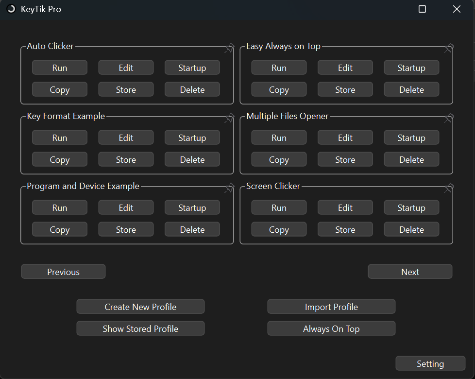

  
    

# KeyTik: The All-in-One Automation Tool

### GUI-Based Keyboard Remapper with Profiles, Auto Clicker, Screen Clicker, Multiple Files Opener, AutoHotkey Script Manager and More.

 

-----------------------------------------------------------------------------------------------------------------------------------------------------------------------------
 

  
## Overview

KeyTik is an open-source, all-in-one automation tool that lets you automate nearly anything at your will. Initially, KeyTik focused on being a keyboard remapper with profiles, allowing you to activate or deactivate each remap individually. However, since KeyTik uses AutoHotkey as the scripting language, it can handle all types of automation available in AutoHotkey, such as auto-clicking, keyboard remapping, screen clicking, opening multiple files, and more. Additionally, the use of AutoHotkey has made KeyTik an AutoHotkey script manager. This means you can easily run, exit, run on startup, edit, store, delete, and more on your AutoHotkey scripts.

With a bit of scripting, you can do almost all automation tasks with ease. If you don't have coding experience, don't worry! I’ve created a beginner-friendly open-source [AutoHotkey script collection and template](https://github.com/Fajar-RahmadJaya/AutoHotkeyCollection) that allows you to download pre-made scripts or edit them to your preference. I’ve tried to make it as easy to understand as possible, with guides on how to use the templates or customize the scripts.

So, if you're looking for a lightweight auto-clicker, keyboard remapper, screen clicker, multiple files opener, and AutoHotkey script manager with a user-friendly GUI in a single software, then this is exactly what you need! I hope you enjoy using KeyTik and find it useful.

**[Note: KeyTik is only available for Windows only following AutoHotkey supported operating system](https://www.autohotkey.com/v2/#:~:text=0.-,v2.,7%20and%20later%20are%20supported.).**

Sincerely,  
**Fajar Rahmad Jaya**

> [!NOTE]
> **If you're satisfied with KeyTik, don't forget to give us a star!**  
> **Also, share it and help the world learn more about us.**

 

## Pro Version

KeyTik Pro version is available at Gumroad at $20 for lifetime purchase. Check out KeyTik Pro at [https://fajarrahmadjaya.gumroad.com/l/keytik-pro](https://fajarrahmadjaya.gumroad.com/l/keytik-pro). 

Pro version has additional features compared to the normal version while not overwhelming it. Think of Pro version as a way to support the developer or as a more user-friendly version of the normal version. Pro version consists of additional UI for the auto clicker, file opener, screen clicker, and additional automation tools such as window manager, easy always-on-top, and multi copy-paste.

Take 25% Off for 10 people only. Check out [https://fajarrahmadjaya.gumroad.com/l/keytik-pro/KeyTikPro25](here) to get the discount. (9 Person Left)

  
 

  
<b>Click to see more</b>

  
  ## KeyTik Pro v4.3.0 Update
  **Changelog**:
- Overall UI improvement.
- Improve key list.
- Keyboard and mouse key addition.
- Add virtual keyboard code on key list.
- Ability to detect and use scan code on default key.
- Add ASCII character on key list.
- Add ANSI character on key list.
- Add Unicode character on key list.
- Bug fixes.

  ## Why You Choose Pro Version
  - Support the developer.
  - More feature than the regular version.
  - Get early access for the upcoming KeyTik update.
  - Expect evolving software. KeyTik Pro macro and automation will increase from time to time. My vision for KeyTik Pro will be a program with various tools inside.

  ## Pro Version Feature
  **Keyboard Remapper**
  - Remap on specific devices and programs.
  - Original key (key that you press will simulate remap key): Single key, multiple key or shortcuts, double click.
  - Remap key (Key that will be shown or simulated when you press original key): Single key, multiple key or shortcuts, hold key, text (Simulate typing such as 'Hello').
  - Vast key and character support. Keyboard and mouse keys, ASCII characters, ANSI characters, keyboard scan codes, virtual keyboard codes, and Unicode characters.
  - Example: Pressing the left shift will hold left click, with the interval chosen by user. Pressing Ctrl+H will type Hello. And more.
  - Multiple remap settings or profiles: You can create your remap settings as much as you want and activate or deactivate them separately.

  **Auto Clicker**
  - Shortcuts: What key to press to activate auto clicker.
  - Click Interval: Interval between each click.
  - Key to press (Mouse Button): What key to press for auto clicker (not just left click or right click but more keys on the keyboard such as all alphabet, shift, ctrl and more)
  - Click type: How will the key press behave. Single click, Double Click, Hold.
  - Click Location: Where click will pressed. Follow cursor, clicking on cursor. Fixed position, position on screen.
  - Click Repeat: How long does the click will pressed. Infinite clicks, stop until it deactivates by shortcuts. Fixed count, click as much as the count specified.

  **Easy Always on Top**
  - Make the window where cursor is located always on top with a shortcut or click.
  - Shortcuts or clicks can be changed by user.

  **Window Size Changer**
  - Change window size with shortcut or click.
  - How window will be changed: Full, horizontal half top, horizontal half bottom, vertical half left, vertical half right, quarter top left, quarter top
right, quarter bottom left, quarter bottom right, original position.
  - The window size will be changed alternately with each click.
Shortcuts or clicks can be changed by user.

  **Multiple Files Opener**
  - Using shortcuts to open multiple files.
  - You can specify what files to open yourself without limit.

  **Multi Copy Paste**
  - Make multiple shortcuts for copy and paste.
  - Each shortcuts have different room to save copied text.
  - For example: First copy shortcuts copied "text1" and second copy shortcuts copied "text2". Pressing second paste shortcuts will paste "text2" and pressing first shortcuts will paste "text1".

  **General Features**
  
  This is a feature that all profile has. Profile is what setting you create whether it's for auto clicker, keyboard remap or anything I have described earlier.
  - Run on startup for individual profiles.
  - Managed profiles: Run, exit, delete, edit, copy each profile.
  - Assign profiles on specific devices: Make profiles only work on specific keyboards or mouse.
  - Assign profiles on specific programs; Make profiles only work on specific programs using program class or process.
  - Store profiles: Move profiles to storage UI and remove them from the main UI.
  - Import profiles: Find AutoHotkey script online and import it to software.
  - Always on top: Make software always on top.

  ## My Plan for the Pro Version
  - Additional UI for file openers.
  - Additional UI for auto clicker.
  - Additional UI for screen clicker.
  - New automation tool, OCR translator. Much like snipping tool but it will translate the chosen screen.
  - New automation tool, easy window always on top. Make window in the cursor to always on top with one click or shortcut.
  - New automation tool, window size changer. Change window size to full size, half screen vertical, half screen horizontal, quarter screen, with a single click or shortcut.
  - New automation tool, multi copy-paste. For example: First copy shortcuts copied "text1" and second copy shortcuts copied "text2". Pressing second paste shortcuts will paste "text2" and pressing first shortcuts will paste "text1".
  - Full macro. Combining auto clicker, screen clicker, keyboard remap, files opener, in a single profile.
  - Macro recording. Record any input and simulate it.
  - The upcoming KeyTik update will be implemented on KeyTik Pro first. KeyTik Pro will get a new version faster than normal KeyTik.

  ## Pro Version Preview
  

  
  

  

  
  

  

  

    
Click to see more 

    

    
    

    

    
    

    

    
    

    

    
    

    

    
    

  

 

## Platform

KeyTik is available at the following platforms:
- [KeyTik Website](https://keytik.com)
- [Source Forge](https://sourceforge.net/projects/keytik/)
- [PitchHut](https://www.pitchhut.com/project/keytik)

 

  
## Table Of Content

1. [Screenshots Preview](https://github.com/Fajar-RahmadJaya/KeyTik?tab=readme-ov-file#screenshots-preview)
2. [Video Guide](https://www.youtube.com/@Fajar-RahmadJaya)
3. [Installation](https://keytik.com/docs/getting-started/installation)
   - [How To Install](https://keytik.com/docs/getting-started/installation#how-to-install)
   - [User Agreement](https://keytik.com/docs/getting-started/installation#user-agreement)
   - [System Requirements](https://keytik.com/docs/getting-started/installation#system-requirements)
   - [Command Line Installation](https://keytik.com/docs/getting-started/installation#command-line-installation)
4. [Features](https://github.com/Fajar-RahmadJaya/KeyTik?tab=readme-ov-file#features)
   - [Key Features](https://github.com/Fajar-RahmadJaya/KeyTik?tab=readme-ov-file#key-features)
   - [Additional Feature](https://github.com/Fajar-RahmadJaya/KeyTik?tab=readme-ov-file#additional-feature)
6. [Use Case Example](https://keytik.com/docs/introduction/use-case)
8. [Automation Tool](https://keytik.com/docs/getting-started/automation-tool)
   - [Auto Clicker](https://keytik.com/docs/getting-started/automation-tool#auto-clicker)
   - [Screen Clicker](https://keytik.com/docs/getting-started/automation-tool#screen-clicker)
   - [Screen Coordinate Auto Detect And Copy](https://keytik.com/docs/getting-started/automation-tool#screen-coordinate-auto-detect-and-copy)
   - [Multiple Files Opener](https://keytik.com/docs/getting-started/automation-tool#multiple-files-opener)
9. [KeyTik Mechanism](https://keytik.com/docs/getting-started/mechanism)
   - [Overall Mechanism](https://keytik.com/docs/getting-started/mechanism#overall-mechanism)
   - [Assign Profile on Specific Device](https://keytik.com/docs/getting-started/mechanism#assign-profile-on-specific-device)
11. [List of Supported Key](https://keytik.com/docs/getting-started/key-list/keyboard)
   - [Keyboard](https://keytik.com/docs/getting-started/key-list/keyboard)
   - [Mouse](https://keytik.com/docs/getting-started/key-list/mouse)
   - [Virtual Keyboard Code](https://keytik.com/docs/getting-started/key-list/vk-code)
   - [Scan Code](https://keytik.com/docs/getting-started/key-list/scan-code)
   - [ASCII](https://keytik.com/docs/getting-started/key-list/ascii)
   - [ANSI](https://keytik.com/docs/getting-started/key-list/ansi)
   - [Unicode](https://keytik.com/docs/getting-started/key-list/unicode)
13. [Safety](https://keytik.com/docs/introduction/safety)
    - [Is KeyTik Safe to Use?](https://keytik.com/docs/introduction/safety#is-keytik-safe-to-use)
    - [Download Options](https://keytik.com/docs/introduction/safety#download-options)
    - [Why are We Include Source Code Version?](https://keytik.com/docs/introduction/safety#why-do-we-include-source-code-version)
    - [Scan Results](https://keytik.com/docs/introduction/safety#scan-results)
    - [Summary](https://keytik.com/docs/introduction/safety#summary)
14. [Have a Suggestion or Question?](https://github.com/Fajar-RahmadJaya/KeyTik?tab=readme-ov-file#have-a-suggestion-or-question)
15. [License](https://github.com/Fajar-RahmadJaya/KeyTik?tab=readme-ov-file#license)
16. [Contributing](https://github.com/Fajar-RahmadJaya/KeyTik?tab=readme-ov-file#contributing)
17. [Star History](https://github.com/Fajar-RahmadJaya/KeyTik?tab=readme-ov-file#star-history)
18. [Acknowledgements](https://github.com/Fajar-RahmadJaya/KeyTik?tab=readme-ov-file#acknowledgements)

 

  
## Screenshots Preview

 

  
## Features

KeyTik comes packed with a wide range of features designed to give you ultimate control over your profiles. Here’s a breakdown of everything you can do with KeyTik:

### Key Features
Below is KeyTik key features that make KeyTik different than another automation tool:
| **No** | **Feature**                                         | **Description** |
|--------|-----------------------------------------------------|-----------------|
| 1      | **Multiple Remap/Macro Profile**                  | Not like most of keyboard remapper, KeyTik can handle multiple keyboard remap. You don't have to set remap again when you need to use another remap then set it back again after done. Just create multiple remap and activate or deactivate it whenever you want. |
| 2      | **Double Click Format**                  | Remap double click into other keys. Example: Double pressing left click will send middle click. |
| 3      | **Text Format**                  | Remap key into raw text. Example: Pressing Shift + 1 will send "Worcestershire Sauce". |
| 4      | **Hold Format**                  | Remap key into a hold action. Example: Triggering mouse wheel up will hold left click for 10 seconds. |
| 5      | **Multi Key Format**                  | Not just single keys, KeyTik supports remapping multiple keys too. This can be used for remapping or sending key. Example: Pressing Left Alt + v will send Shift + v.|
| 6      | **Vast Keyboard and Mouse Key Support**                  | Supports a wide range of keyboard and mouse keys, even unusual ones. See [Key List JSON](https://github.com/Fajar-RahmadJaya/KeyTik/blob/main/src/_internal/Data/key_list.json) for more. There are around 115 keyboard and mouse specific keys (like Tab, Shift, etc). |
| 7      | **ASCII Character Support**                  | Supports remapping and sending ASCII characters. There are around 94 ASCII characters are supported. |
| 8      | **ANSI Character Support**                  | Supports sending ANSI characters. There are around 122 ANSI characters are supported. |
| 9      | **Unicode Character Support**                  | Supports sending Unicode characters. Unicode contains a vast number of characters. KeyTik groups them using Unicode blocks, and each block consists of different characters. There are around 302 supported blocks, with approximately 159,000+ Unicode characters. |
| 9      | **Virtual Keyboard Code Support**                  | Supports remapping and sending VK codes. Virtual keyboard codes (VK codes) are keys defined by Windows. There are around 258 VK codes are supported. |
| 10      | **Scan Code Support**                  | Supports remapping keys via SC. Scan codes (SC) are hardware-specific codes that indicate key location. This is useful if you can't find your key. SC will remaps the key at a specific location instead of a specific key. The number of supported scan codes depends on your keyboard. |
| 11      | **Assign Shortcut on Profile**                  | Assign shortcuts to start or stop profiles. Supports Caps Lock On and Caps Lock Off states. Currently, shortcuts only start or stop the profile. We plan to add shortcut switching in the future, so shortcuts can change the remap when pressed. This is similar to how Caps Lock or Num Lock works. |
| 12      | **Bind Profile to Specific Keyboard and Mouse** | Make script or remap profile to only work for specific physical keyboard or mouse using device VID & PID or device handle as identifier.|
| 13      | **Bind Profile to Specific Program** | Make script or remap profile to only work for specific programs class, like specific Chrome tab or entire program.|
| 14      | **Auto Clicker**                   | KeyTik comes with Auto Clicker in the download. On default, it simulate 'left click' when 'e' is held. You can change the 'left click', 'e', interval part to your preference.|
| 15      | **Screen Clicker**                   | KeyTik also comes with Screen Clicker in the download. It work with simulate 'left click' on specific screen coordinate. You can change coordinate and interval to your preference. Don't worry because KeyTik also comes with tool to find screen coordinate then it will automatically copy coordinate and you can paste it to screen clicker in text mode.|
| 16      | **Screen Coordinate Auto Detect And Copy**                   | To make screen clicker editing easier, KeyTik also comes with coordinate finder. On default, you just need to press 'space' then it will show coordinate and automatically copy it. You can also change 'space' part to your preference.|
| 17      | **Multiple Files Opener**                   | Multiple files opener also comes with KeyTik download. It work with, if you click key or key combination, then it will open the files. You can change the files with your files or programs path to your preference.|

### Additional Feature
Below is another KeyTik feature to increase user experience and give ultimate control over each profiles:
| **No** | **Feature**                                         | **Description** |
|--------|-----------------------------------------------------|-----------------|
| 1      | **Manage Profiles** | Run, Exit, Delete, Store, Edit, Pin each profiles for better control over profiles.|
| 2      | **Run Profile on Startup**                         | Run profiles on startup, so it will automatically activate when you open your device—no need to manually activate it each time. |
| 6     | **Make Window Always on Top**                      | "Always on top" feature lets you easily remap keys while other windows are open, without minimizing KeyTik window. This is especially useful during gaming. |
| 7| **Show Stored Profile** | Display your stored profile or restore it to main window. |
| 8     | **Import Profile**                                 | Use AutoHotkey script from external source like download and make it as profile. |
| 9      | **Automatically Take Key Input**                   | A button that can make you click your desired key and it will automatically fill key entry                |

 

  
## Have a Suggestion or Question?

We’d love to hear from you! Your feedback is essential for the continued improvement of KeyTik. If you have any suggestions or question, please submit it on the [KeyTik Issues page](https://github.com/Fajar-RahmadJaya/KeyTik/issues).

To make it easier for you to submit feedback, we’ve provided several issue templates. Please select the one that best matches your feedback:
- **[Automation Tool Suggestion](https://github.com/Fajar-RahmadJaya/KeyTik/issues/new?assignees=&labels=Automation+Tool+Suggestion%2C+Supported+Key+Suggestion&projects=&template=automation-tool-suggestion.md&title=Automation+Tool+Suggestion)**: Suggest additions to KeyTik’s built-in automation tools.
- **[Bug Report](https://github.com/Fajar-RahmadJaya/KeyTik/issues/new?assignees=&labels=bug&projects=&template=bug-report.md&title=Bug+Report)**: Report any bugs or issues you’ve encountered to help us improve.
- **[Feature Suggestion](https://github.com/Fajar-RahmadJaya/KeyTik/issues/new?assignees=&labels=Feature+Suggestion&projects=&template=feature_suggestion.md&title=Feature+Suggestion)**: Suggest an idea for a new feature or improvement for the project.
- **[Question](https://github.com/Fajar-RahmadJaya/KeyTik/issues/new?assignees=&labels=Question&projects=&template=question.md&title=Question)**: Ask any question about KeyTik.
- **[Supported Key Suggestion](https://github.com/Fajar-RahmadJaya/KeyTik/issues/new?assignees=&labels=Supported+Key+Suggestion&projects=&template=supported-key-suggestion.md&title=Supported+Key+Suggestion)**: Suggest a key to include in the list if you find some keys aren’t working.
- **[Windows Warning Report](https://github.com/Fajar-RahmadJaya/KeyTik/issues/new?assignees=&labels=Windows+Warning+Report&projects=&template=windows-warning-report.md&title=Windows+Warning+Report)**: Report any Windows warnings, such as untrusted author notifications or false positives.
Simply choose the most relevant template and provide as much detail as possible. Your input will help us improve KeyTik for everyone!

Thank you for your support — we truly appreciate it!

 

  
## License
This project is licensed under the [Apache License 2.0](http://www.apache.org/licenses/LICENSE-2.0). You can freely use, modify, and distribute this code under the terms of the license.

 

  
## Contributing
Contributions are welcome! You can contribute by submitting a **pull request** for improvements, such as bug fixes, new features, or automation tool additions. Please follow the [Contribution Guidelines](https://github.com/Fajar-RahmadJaya/KeyTik/blob/main/CONTRIBUTING.md) when making contributions.

Thank you for helping improve this project!

 

  
## Star History

<a href="https://star-history.com/#Fajar-RahmadJaya/KeyTik&Date">
 <picture>
   <source media="(prefers-color-scheme: dark)" srcset="https://api.star-history.com/svg?repos=Fajar-RahmadJaya/KeyTik&type=Date&theme=dark" />
   <source media="(prefers-color-scheme: light)" srcset="https://api.star-history.com/svg?repos=Fajar-RahmadJaya/KeyTik&type=Date" />
   
 </picture>
</a>

 

  
## Acknowledgements

This project uses the following libraries:

- **Python Standard Library**: Includes modules like `os`, `shutil`, `tkinter`, `subprocess`, `json`, `time`, and `sys`, licensed under the [Python Software Foundation License](https://docs.python.org/3/license.html).
- **pynput**: Licensed under the [MIT License](https://opensource.org/licenses/MIT).
- **win32com.client**: Licensed under the [Python Software Foundation License](https://docs.python.org/3/license.html).
- **PIL**: Licensed under the [MIT License](https://opensource.org/licenses/MIT).
- **keyboard**: Licensed under the [MIT License](https://opensource.org/licenses/MIT).
- **AutoHotkey Interception**: Licensed under the [MIT License](https://opensource.org/licenses/MIT).
- **Winshell**: Licensed under the [MIT License](https://opensource.org/licenses/MIT).
- **Interception**: Licensed under the [LGPL 3.0 License](https://www.gnu.org/licenses/lgpl-3.0.en.html#license-text).
  - Source Code: https://github.com/oblitum/Interception 

 

