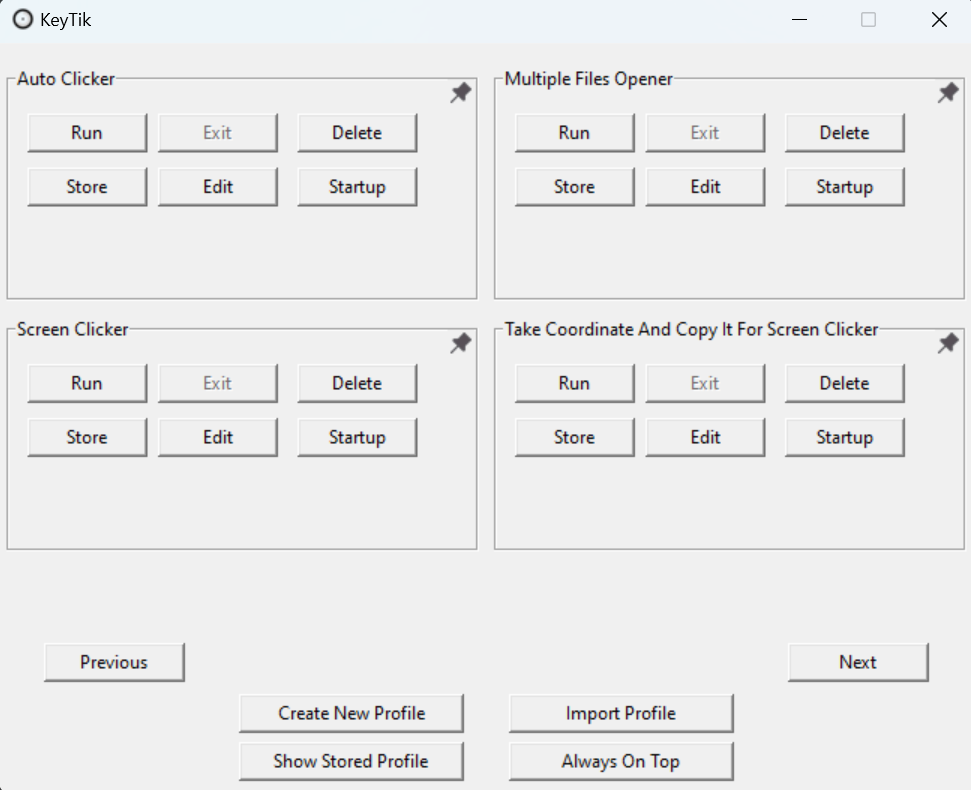

# KeyTik: The All-in-One Automation Tool & Keyboard Remapper with Profiles
## GUI-Based Keyboard Remapper with Profiles, Auto Clicker, AutoHotkey Manager, and More.
KeyTik is an open-source automation tool that can do almost all automation at your will. At first, KeyTik focused on keyboard remapper with profile to activate or deactivate each remap individually. But because it also use AutoHotkey as scripting language to do the automation, it allow KeyTik to do all automation available by AutoHotkey such as auto clicker, keyboard remapper, screen clicker and more. 

With a bit of scripting you can do all of that with ease. If you don't have coding experience, don't worry because i also made a beginner friendly open-source AutoHotkey script collection and template that allow you to download already made script or edit it to your preference. I try to make it as easy to understand as possible with guide how to use the template or change the code in each script, make sure to visit it at [AutoHotkey Script Collection And Template](https://github.com/Fajar-RahmadJaya/AutoHotkeyCollection) if you are interested. 

So if you are looking for lightweight auto clicker, keyboard remapper, screen clicker and more or All-in-One Automation Tool and AutoHotkey script manager with user friendly GUI, then this is what you are looking for. I hope you can enjoy it and it can be useful to you. Sincerely, Fajar Rahmad Jaya.

> [!NOTE]
> **Don't forget to give us star if you are satisfied with KeyTik and share it so the world can know about KeyTik.**
>  
> **Also help me fill my GitHub poll to know how much KeyTik user is in [KeyTik User Survey Poll](https://github.com/Fajar-RahmadJaya/KeyTik/discussions/3).**
>  
> **Sincerely, thank You.**

## Table Of Content :
1. [Preview.](https://github.com/Fajar-RahmadJaya/KeyTik?tab=readme-ov-file#preview-)
2. [Platform.](https://github.com/Fajar-RahmadJaya/KeyTik?tab=readme-ov-file#platform-)
3. [How To Install.](https://github.com/Fajar-RahmadJaya/KeyTik?tab=readme-ov-file#how-to-install-)
4. [Features.](https://github.com/Fajar-RahmadJaya/KeyTik?tab=readme-ov-file#features-)
5. [What Make Us Different Then Other Automation Tool.](https://github.com/Fajar-RahmadJaya/KeyTik?tab=readme-ov-file#what-make-us-different-then-other-automation-tool-)
6. [Feature Plan (Possibly to be Implemented).](https://github.com/Fajar-RahmadJaya/KeyTik?tab=readme-ov-file#feature-plan-possibly-to-be-implemented-)
7. [Example How You Can Use Each Feature.](https://github.com/Fajar-RahmadJaya/KeyTik?tab=readme-ov-file#example-how-you-can-use-each-feature-)
8. [How To Use KeyTik Automation Tool.](https://github.com/Fajar-RahmadJaya/KeyTik?tab=readme-ov-file#how-to-use-keytik-automation-tool-)
9. [User Safety (For Those Who Worry About Virus Or Data Safety).](https://github.com/Fajar-RahmadJaya/KeyTik?tab=readme-ov-file#user-safety-for-those-who-worry-about-virus-or-data-safety-)
10. [Have Any Suggestion ?](https://github.com/Fajar-RahmadJaya/KeyTik?tab=readme-ov-file#have-any-suggestion-)
11. [License.](https://github.com/Fajar-RahmadJaya/KeyTik?tab=readme-ov-file#license-)
12. [Acknowledgements.](https://github.com/Fajar-RahmadJaya/KeyTik?tab=readme-ov-file#acknowledgements-)

## Preview :

## Platform :
**Source Forge : https://sourceforge.net/projects/keytik**

**Quora : https://www.quora.com/profile/KeyTik**

## How To Install :
To install KeyTik you just need to follow these step :
1. **Download And Install AutoHotkey**
    - AutoHotkey Download Website : https://www.autohotkey.com/download/.
    - If you encounter any issues with AutoHotkey installation, Visit AutoHotkey install documentation at : https://www.autohotkey.com/docs/v2/howto/Install.htm.
2. **Download KeyTik from one of the following platforms**
    - KeyTik v1.1 Github Release : https://github.com/Fajar-RahmadJaya/KeyTik/releases/tag/v1.1.
    - Source Forge : https://sourceforge.net/projects/keytik.
3. **Extract KeyTik zip file**
    - Extract the downloaded KeyTik zip file to a location of your choice.
4. **Open KeyTik folder**
    - Navigate to the folder where you extracted KeyTik and locate KeyTik.exe.
5. **Run KeyTik**
    - Double-click KeyTik.exe to start it.
6. **You're All Set!**
    - KeyTik should now be ready to use.

> [!NOTE]
> **Ensure that AutoHotkey is installed correctly, as it is required for KeyTik to be able to run profile.**  

## Features :
KeyTik comes packed with a wide range of features designed to give you ultimate control over your profiles. Here’s a breakdown of everything you can do with KeyTik:

| **No** | **Feature**                                         | **Description** |
|--------|-----------------------------------------------------|-----------------|
| 1      | **Run & Exit Remap Profile** | Activate or deactivate profiles individually, so you don't need to adjust the remap every time. |
| 2      | **Run Profile on Startup**                         | Run profiles on startup, so it will automatically activate when you open your device—no need to manually activate it each time. |
| 3      | **Delete & Store Remap Profile**                   | Delete unnecessary profiles and store profiles for a clean main window without permanently removing them. |
| 4      | **Pin Profile**                                    | Pin your favorite profiles for quick and easy access. |
| 5      | **Edit Remap Profile**                             | Adjust your profile to your preference. |
| 6      | **Create Multiple Remap Profile**                  | You can create remap not only once but multiple time. |
| 7      | **Assign Shortcut on Each Profile**                | Enable or Disable your profile using shortcuts. |
| 8      | **Default Mode in Create or Edit Profile**         | The easiest way to remap your keyboard. |
| 9      | **Text Mode in Create or Edit Profile**            | Text Mode allows you to adjust or create your AutoHotkey script easily, without needing an external editor.  |
| 10     | **Make Window Always on Top**                      | "Always on top" feature lets you easily remap keys while other windows are open, without minimizing KeyTik window. This is especially useful during gaming. |
| 11     | **Show Stored Profile**                            | Display your stored profile or restore it to main window. |
| 12     | **Import Profile**                                 | Use AutoHotkey script from external source like download and make it as profile. |
| 13      | **Automatically Take Key Input**                   | A button that can make you click your desired key and it will automatically fill key entry                |
| 14      | **Auto Clicker**                   | KeyTik comes with Auto Clicker in the download. On default, it simulate 'left click' when 'e' is holded. You can change the 'left click', 'e', interval part to your preference. See [How To Use KeyTik As Auto Clicker](https://github.com/Fajar-RahmadJaya/KeyTik?tab=readme-ov-file#auto-clicker) for more info.                 |
| 15      | **Screen Clicker**                   | KeyTik also comes with Screen Clicker in the download. It work with simulate 'left click' on specific screen coordinate. You can change coordinate and interval to your preference. Don't worry because KeyTik also comes with tool to find screen coordinate then it will automatically copy coordinate and you can paste it to screen clicker in text mode, see point 16. see [Screen Clicker](https://github.com/Fajar-RahmadJaya/KeyTik?tab=readme-ov-file#screen-clicker-) for more info.                |
| 16      | **Screen Coordinate Auto Detect And Copy**                   | To make screen clicker editing easier, KeyTik also comes with coordinate finder. On default, you just need to press 'space' then it will show coordinate and automatically copy it. You can also change 'space' part to your preference. See [Screen Coordinate Auto Detect And Copy](https://github.com/Fajar-RahmadJaya/KeyTik?tab=readme-ov-file#screeen-coordinate-auto-detect-and-copy-) for more info.               |
| 17      | **Multiple Files Opener**                   | Multiple files opener also comes with KeyTik download. It work with, if you click key or key combination, then it will open the files. You can change the files with your files or programs path to your preference. see [Multiple Files Opener](https://github.com/Fajar-RahmadJaya/KeyTik?tab=readme-ov-file#multiple-files-opener-) for more info.               |

## What Make Us Different Then Other Automation Tool :
KeyTik have unique capabilities and make it different than other automation tool. Here’s why KeyTik is the best choice for your need:"

- **Various Functionality**:
  - KeyTik offer various remapping and scripting functionalities that will give you more control over your profiles.
  - Check out [Feature Section for more]([feature](https://github.com/Fajar-RahmadJaya/KeyTik?tab=readme-ov-file#features-))

- **Flexible with Great Potential**:
  - Using AutoHotkey as profile script language, allow KeyTik to utilize all feature and potential from AutoHotkey.

- **Lightweight and Easy to Use**:
  - It’s only 85.5MB!! (KeyTik v1.1)
  - User friendly and simple GUI to boost functionality and simplicity
  - Easy to understand while providing plenty of features.

- **All-in-One Automation Tool**:
  - **Auto Clicker**: Bundled with the download, allow you to adjust the auto clicker to your preferences for more advanced automation. Check out [How To Use KeyTik as Auto Clicker](https://github.com/Fajar-RahmadJaya/KeyTik?tab=readme-ov-file#how-to-use-keytik-as-auto-clicker-).

- **And More.**

## Feature Plan (Possibly to be Implemented) :
Below are my plan and what i have in mind for future KeyTik Development :

| **No** | **Feature Plan**                                   | **Description** | **Status** |
|--------|----------------------------------------------------|-----------------|------------|
| 1      | **Assign Script or Remap for Multiple or Different Physical Keyboards** | Make profile only work for some physical keyboard using keyboard ID as identifier | InProgress |
| 2      | **Resize and Remember Window Size**                |  Resize KeyTik window for more comfortable use and remember it so next time you open KeyTik, it will retain previous window size | Pending |
| 3      | **Helper to Know What Remap Key in Profile**       | hover to question mark icon or another way will show what key or script that profile use. | Pending |
| 4      | **Refine Error Handling**                          | Adding more helpful error handling like "you don't have AutoHotkey installed on your device. Download it first on https://www.autohotkey.com/download/ to make KeyTik work. | Pending |

## Example How You Can Use Each Feature :
**1. Multiple profile :**
* When you need multiple condition to activate remap like for different game or you need to remap some key for only one condition and don't need to always activate it, you can make different profile as you need and activate or deactivate individually so you don't need to adjust your remap every single time you need it for another condition.
  
**2. Always on top :**
* When you playing game and that game didn't have change input function, you can make KeyTik window to always on top using "Enable Always On Top" button, so you can play the game, try the game input and change the input in KeyTik or try the remap profile on that game without go back and forth between game window and KeyTik window.
  
**3. Store Profile :**
* If you don't want to show profile in the main window but you still need it or you just want to store it for future, you can store the profile using "Store" button. If you happen want to run it, you can use "Show Stored Profile" and it will show your stored profile an if you want to show it back in main window, you can use "Retrieve" button to move it back to main window.
  
**4. Run On Startup :**
* If you have damaged key on your keyboard and want to remap it permanently (You can still disable it so it's not entirely permanent) without activate it manually every single time you open your computer, you can use "Startup" button to make profile run on startup. If you do that, your profile will active every single time you open your computer. You can disable it using "Unstart" or disable it in task manager startup apps.
  
**5. Text Mode :**
* Text mode is for more advance remapping. KeyTik using AutoHotkey as profile automation script language and text mode allow you to edit your script without opening  script editor. You can use this when you need to adjust your script or use it for automation like auto clicking etc. The reason for this feature is, so that you can use full potential of AutoHotkey and not limited to just remapping some key.
  
**6. Import Profile :**
* You can add AutoHotkey script from outside, like download script from someone or from some platform and use it as profile. It work with adding another command in your imported script so it can use functionality from KeyTik. I also made an open-source repository for AutoHotkey Script Collection and template that allow you to download already made AutoHotkey script. AutoHotkey Script Collection and template also give you guide on how to adjust the script to your preferences or using the script as script template. Click this "[AutoHotkey Script Collection](https://github.com/Fajar-RahmadJaya/AutoHotkeyCollection)" if you are interested.
  
**7. Auto Clicker :**
* With a bit of scripting, you can add many automation tool to your preferences such as auto clicker. As for how to do it refer to [How To Use KeyTik as Another Automation](https://github.com/Fajar-RahmadJaya/KeyTik?tab=readme-ov-file#how-to-use-auto-clicker-) or scroll above.
  
**8. Screen Clicker :**
* Still at work, look forward to it!!
  
**9. Multiple Files Opener Using Shortcut :**
* Still at work, look forward to it!!
  
**10. Pin Profile :**
* You can pin your favorite profile or profile that you use the most so it can showed first in the profile list. You just need to click pin icon on the profile to make it work.
  
**11. And many more.**

## How To Use KeyTik Automation Tool :
Automation tools come bundled as one with KeyTik download. It count as profile in text mode, so all of it can use KeyTik feature. I take it from my side project on [AutoHotkey Script Collection And Template](https://github.com/Fajar-RahmadJaya/AutoHotkeyCollection). I add comment on the script to make it easier to change. So if there are ";" on the line in script that mean after it or ";" right is comment and what you can change is before it or left ";". Example : '''space:: ; This is comment'''. On that example 'space' is what you can change and '; this is comment' is the comment. Comment mean AutoHotkey not detect it as input which mean comment is not affecting script.

### Auto Clicker:
Auto Clicker default is to simulate 'left click' when holding 'e' key with 100 millisecond interval. You can adjust it to your preference  like change the 'e' key, change left click and change interval. For more guide on how to adjust or download the script, go to AutoHotkey Script Collection And Template release on [Auto Clicker When Holding Specific Key](https://github.com/Fajar-RahmadJaya/AutoHotkeyCollection/releases/tag/AutoClickHoldingKey).

### Screen Clicker :
Screen clicker work with It work with simulate 'left click' on specific screen coordinate. You can change coordinate and interval to your preference. Don't worry because KeyTik also comes with tool to find screen coordinate then it will automatically copy.

### Screen Coordinate Auto Detect And Copy :
To make screen clicker editing easier. I also include coordinate detector to KeyTik. On default, you just need to move your cursor to desired position then press 'space'. After that, it will show coordinate and automatically copy it. You can then just paste whenever you want. You can also change 'space' part to you preference.

### Multiple Files Opener :
You can open multiple files only with one key or more. In default, it use alt + left to open some files or program. You can change files path with your files or programs path to your preference. Make sure you change files path to yours because in default it only give you path example not the actual path.

## User Safety (For Those Who Worry About Virus Or Data Safety) :
I don't make this software for that reason and this software is open source, so you can rest assured. If you still have doubt, you can try [Virus Total](https://www.virustotal.com/gui/home/upload) to scan it. Virus Total is known for it being a free online service that analyzes files and URLs for viruses, malware, and other malicious content by scanning them with a wide range of antivirus engines and security tools. The scan is done each version release to ensure safety. The conclusion is, i don't intend to add virus or take your personal data intentionally or without your permission. I want to build trust for KeyTik user so they can use KeyTik without worry. 

But if you still have some doubt, i also include non built version on release. With it you can check the source code yourself. You can also build it yourself, i also include buld guide on the download or you can check it [here](https://github.com/Fajar-RahmadJaya/KeyTik/blob/main/Build%20Guide.txt). Again, i don't intend to add malware on KeyTik so don't be afraid to download the normal version which i build myself using the same code in source code version.

Here is my scan on KeyTik v1.2 using virus Total if you have doubt (You can also scan for yourself if you want 100% certain) :

* Report Screenshots :

* Full scan report : 
   - Normal Download Version : https://www.virustotal.com/gui/file/69acdb1a58e5a22383790f785dbf138eae3cc57da9dac21ca3e61b817d83df84?nocache=1
   - Source Code Download Version : https://www.virustotal.com/gui/file/82f076b8d3f5487c4b46c32707c313b1ba879e561100c33514ebb053926b7bc8?nocache=1

## Have Any Suggestion ?
If you have any suggestion for KeyTik, i would be very happy to take it. You can show your suggestion on [GitHub issue](https://github.com/Fajar-RahmadJaya/KeyTik/issues). The more you give suggestion, the better i can improve KeyTik. So don't be shy to show your suggestion or problem. Try to be polite and don't offend any individual or group. Together, lets make this a wholesome community. I sincerely appreciate your trust and continued support. Thank you. Sincerely, Fajar Rahmad Jaya.

## License :
This project is licensed under the [Apache License 2.0](http://www.apache.org/licenses/LICENSE-2.0). You can freely use, modify, and distribute this code under the terms of the license.

## Acknowledgements :
- This project uses the following libraries:
  - **Python Standard Library**: Includes modules like `os`, `shutil`, `tkinter`, `messagebox`, `subprocess`, and `sys`, licensed under the [Python Software Foundation License](https://docs.python.org/3/license.html).
  - **pynput**: Licensed under the [MIT License](https://github.com/moses-palmer/pynput/blob/master/COPYING.LGPL).
  - **AutoHotkey**: Licensed under the [GPL 2.0 License](https://github.com/AutoHotkey/AutoHotkey/blob/alpha/license.txt).
  - **Winshell**: Licensed under the [MIT License](https://github.com/tjguk/winshell/blob/master/LICENSE.txt).
